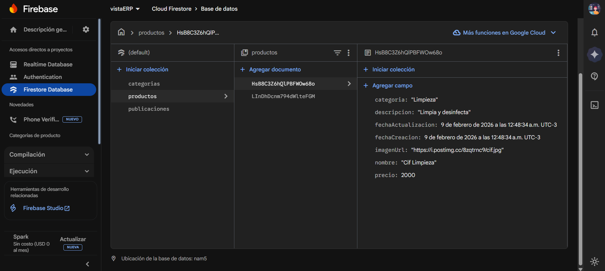

# 🏢 vistaERP – Web Corporativa + ERP con Panel Administrador

**vistaERP** es un proyecto web que combina una **página de presentación empresarial** con un **sistema ERP básico**, permitiendo **mostrar productos al público** y **administrarlos desde un panel administrador**.

El sistema está diseñado con enfoque **Mobile First**, pensado para pequeñas empresas que necesitan una solución simple para exhibir su catálogo y gestionar información desde la nube.

---

## 🌐 Demo en vivo

Puedes acceder al proyecto como **visualizador / demostración** desde el siguiente enlace:

🔗 **https://crisdev-ch.github.io/vistaERP/vistaERP/index.html**

No requiere instalación.

---

## 🎯 ¿Qué es vistaERP?

Este proyecto cumple dos funciones principales:

### 🖥️ Página web de presentación
- Muestra información de la empresa
- Presenta productos de forma visual
- Catálogo accesible desde cualquier dispositivo
- Diseño moderno y responsive

### 🧭 Sistema ERP con Panel Administrador
- Gestión de productos
- Actualización de información en tiempo real
- Administración centralizada desde la nube
- Simulación de un ERP real para pequeñas empresas

---

## 📱 Enfoque Mobile First

La interfaz fue desarrollada siguiendo el enfoque **Mobile First**, lo que significa que:

- El diseño prioriza pantallas móviles 📲
- Navegación simple y clara
- Controles pensados para uso táctil
- Adaptación total a desktop y tablet

---

## 🧭 Panel Administrador + Firebase

El proyecto utiliza **Firebase (Cloud Firestore)** como backend en la nube para:

- Almacenar productos
- Guardar categorías
- Gestionar publicaciones
- Mantener la información persistente
- Actualizar datos en tiempo real

### 🔍 Estructura de datos en Firebase

  

En la imagen se puede observar cómo:

- Los productos se almacenan en colecciones
- Cada producto contiene:
  - Nombre
  - Categoría
  - Descripción
  - Precio
  - Fechas de creación y actualización
  - URL de imagen
- La información se gestiona directamente desde Firestore

---

## 🖼️ Carga de imágenes con servicios externos

Para facilitar la carga de imágenes desde el **panel administrador**, el sistema utiliza **servicios gratuitos de hosting de imágenes**, como:

### 🔹 PostImage
- Servicio externo gratuito
- Permite subir imágenes de forma rápida
- Genera URLs directas
- No requiere backend propio ni almacenamiento complejo

### ✅ Beneficios de este enfoque
- Simplifica la gestión de imágenes
- Ideal para proyectos frontend
- Permite integrar imágenes fácilmente en Firebase
- Simula un flujo real de administración de productos

Las URLs generadas se guardan directamente en Firestore y luego se consumen desde la web pública.

---

## 🛠️ Tecnologías utilizadas

- **HTML** → estructura del sitio  
- **CSS** → diseño visual y responsive  
- **JavaScript (Vanilla)** → lógica de la aplicación  
- **Firebase (Cloud Firestore)** → base de datos en la nube  
- **Servicios externos de imágenes (PostImage)** → carga de imágenes  

No se utilizan frameworks frontend, manteniendo el proyecto liviano y fácil de entender.
